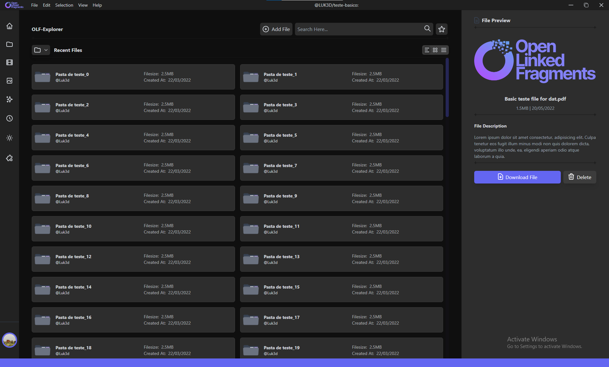

## Open Linkend Fragments Explorer

Welcome 🖖 to the OLF-Explorer project. This is an extension of [Open Linked Fragments](https://github.com/LUK3D/Open-Linked-Fragments) project.

We are creating an easy way to manage your fragmented files by creating a File Explorer with moder User Interface and User Experience.

## Screen Shots

> OLF-Explorer Dark mode

> OLF-Explorer Dark mode

> OLF-Explorer Light mode
> 

> OLF-Explorer Light mode

> OLF-Explorer Dark mode

## ✔ Download

If you look at the right side panel, you will see a download button that you can use to get a copy of the most updated build.

## 💪 Contribute

You can be parte of the project by forking the project, make improvements and send a push request.

## 🚀 Features:

Some cool stuf to be made

| #   | Feature                                        | State |
| --- | ---------------------------------------------- | ----- |
| 1   | Basic Explorer functions                       | ✔     |
| 2   | Github Authentication                          |
| 3   | Dark Theme                                     | ✔     |
| 4   | Dark Theme Folder Varients                     | ✔     |
| 5   | Line Layout for Folder List                    | ✔     |
| 6   | Grid layout for Folder List                    | ✔     |
| 7   | File Fragmentation                             |
| 9   | File Download                                  |
| 8   | File Preview                                   |
| 10  | Create new Empty Folder                        |
| 12  | Move Files and Folders                         |
| 13  | Delete Files and Folders                       |
| 14  | Share Files Between Users                      |
| 15  | Extentions Integration                         |
| 16  | Dev Api to extend the Explorer Functionalities |
